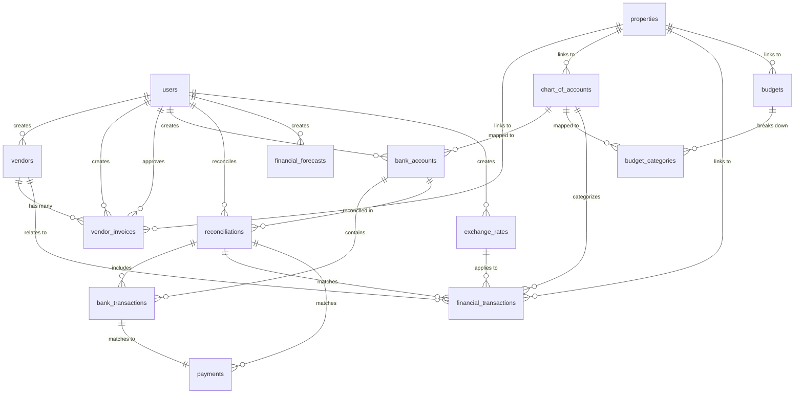

# Database ERD - Finance Module Enhancements
## Emirates Lease Flow - Enhanced Entity-Relationship Diagram

**Version**: 1.0  
**Date**: October 16, 2025  
**Status**: Design Phase

---

## Table of Contents
1. [Overview](#1-overview)
2. [New Tables](#2-new-tables)
3. [Enhanced Existing Tables](#3-enhanced-existing-tables)
4. [Relationships](#4-relationships)
5. [ERD Diagrams](#5-erd-diagrams)
6. [Indexes](#6-indexes)
7. [Migration Scripts](#7-migration-scripts)

---

## 1. Overview

### 1.1 Summary
This document outlines the database schema changes required for the Finance Module enhancements. It includes 8 new tables and modifications to 5 existing tables.

### 1.2 New Tables (8)
1. `vendors` - Supplier/vendor management
2. `vendor_invoices` - Vendor invoice tracking
3. `bank_accounts` - Bank account management
4. `bank_transactions` - Imported bank statement data
5. `reconciliations` - Bank reconciliation records
6. `financial_forecasts` - Cash flow predictions
7. `exchange_rates` - Multi-currency exchange rates
8. `budget_categories` - Budget category breakdown

### 1.3 Enhanced Tables (5)
1. `chart_of_accounts` - Add property linkage, tax categories, reconciliation flags
2. `financial_transactions` - Add vendor, property, reconciliation links
3. `budgets` - Add property linkage, alert settings
4. `invoices` - Add vendor invoice reference
5. `payments` - Add bank transaction linkage

---

## 2. New Tables

### 2.1 vendors

**Purpose**: Store vendor/supplier information for accounts payable

```sql
CREATE TABLE vendors (
  id INT PRIMARY KEY AUTO_INCREMENT,
  vendor_number VARCHAR(50) UNIQUE NOT NULL COMMENT 'VEN-YYYY-XXXX',
  vendor_name VARCHAR(255) NOT NULL,
  contact_person VARCHAR(100),
  email VARCHAR(255) UNIQUE,
  phone VARCHAR(20),
  address TEXT,
  city VARCHAR(100),
  emirate ENUM('Abu Dhabi', 'Dubai', 'Sharjah', 'Ajman', 'Umm Al Quwain', 'Ras Al Khaimah', 'Fujairah'),
  trade_license_number VARCHAR(100),
  trn VARCHAR(15) COMMENT 'Tax Registration Number',
  payment_terms ENUM('COD', 'Net 7', 'Net 15', 'Net 30', 'Net 45', 'Net 60', 'Net 90') DEFAULT 'Net 30',
  bank_details JSON COMMENT '{"bank_name": "", "account_number": "", "iban": "", "swift": ""}',
  payment_method ENUM('bank_transfer', 'cheque', 'cash', 'credit_card') DEFAULT 'bank_transfer',
  category ENUM('maintenance', 'utilities', 'insurance', 'services', 'supplies', 'other') DEFAULT 'other',
  status ENUM('active', 'inactive') DEFAULT 'active',
  notes TEXT,
  created_by INT NOT NULL,
  created_at DATETIME DEFAULT CURRENT_TIMESTAMP,
  updated_at DATETIME DEFAULT CURRENT_TIMESTAMP ON UPDATE CURRENT_TIMESTAMP,
  deleted_at DATETIME NULL,
  
  INDEX idx_vendor_name (vendor_name),
  INDEX idx_vendor_status (status),
  INDEX idx_vendor_category (category),
  INDEX idx_created_by (created_by),
  
  FOREIGN KEY (created_by) REFERENCES users(id)
) ENGINE=InnoDB DEFAULT CHARSET=utf8mb4 COLLATE=utf8mb4_unicode_ci
COMMENT='Vendor/Supplier Master Data';
```

**Sample Data**:
```sql
INSERT INTO vendors (vendor_number, vendor_name, email, phone, emirate, payment_terms, category, status, created_by) VALUES
('VEN-2025-0001', 'Dubai Maintenance Services', 'info@dubaimaintenance.ae', '+971-4-1234567', 'Dubai', 'Net 30', 'maintenance', 'active', 1),
('VEN-2025-0002', 'DEWA', 'billing@dewa.gov.ae', '+971-4-6019999', 'Dubai', 'Net 15', 'utilities', 'active', 1),
('VEN-2025-0003', 'Emirates Insurance Company', 'claims@emiratesins.ae', '+971-2-9876543', 'Abu Dhabi', 'Net 30', 'insurance', 'active', 1);
```

---

### 2.2 vendor_invoices

**Purpose**: Track invoices from vendors (accounts payable)

```sql
CREATE TABLE vendor_invoices (
  id INT PRIMARY KEY AUTO_INCREMENT,
  invoice_number VARCHAR(50) UNIQUE NOT NULL COMMENT 'VIN-YYYY-XXXX',
  vendor_id INT NOT NULL,
  vendor_invoice_number VARCHAR(100) COMMENT 'Vendor''s invoice number',
  purchase_order_number VARCHAR(100) COMMENT 'PO reference (future)',
  invoice_date DATE NOT NULL,
  due_date DATE NOT NULL,
  line_items JSON NOT NULL COMMENT '[{"description": "", "quantity": 0, "unit_price": 0, "total": 0, "vat_percent": 5, "account_code": ""}]',
  subtotal DECIMAL(15,2) NOT NULL,
  vat_amount DECIMAL(15,2) DEFAULT 0,
  total_amount DECIMAL(15,2) NOT NULL,
  paid_amount DECIMAL(15,2) DEFAULT 0,
  outstanding_amount DECIMAL(15,2) DEFAULT 0,
  status ENUM('draft', 'pending_approval', 'approved', 'partially_paid', 'paid', 'cancelled') DEFAULT 'draft',
  approval_status ENUM('pending', 'approved', 'rejected') DEFAULT 'pending',
  approved_by INT NULL,
  approved_at DATETIME NULL,
  paid_date DATE NULL,
  payment_reference VARCHAR(100),
  attachments JSON COMMENT '["url1", "url2"]',
  notes TEXT,
  property_id INT NULL COMMENT 'Link to specific property',
  created_by INT NOT NULL,
  created_at DATETIME DEFAULT CURRENT_TIMESTAMP,
  updated_at DATETIME DEFAULT CURRENT_TIMESTAMP ON UPDATE CURRENT_TIMESTAMP,
  deleted_at DATETIME NULL,
  
  INDEX idx_vendor (vendor_id),
  INDEX idx_status (status),
  INDEX idx_invoice_date (invoice_date),
  INDEX idx_due_date (due_date),
  INDEX idx_property (property_id),
  INDEX idx_created_by (created_by),
  
  FOREIGN KEY (vendor_id) REFERENCES vendors(id),
  FOREIGN KEY (approved_by) REFERENCES users(id),
  FOREIGN KEY (property_id) REFERENCES properties(id),
  FOREIGN KEY (created_by) REFERENCES users(id)
) ENGINE=InnoDB DEFAULT CHARSET=utf8mb4 COLLATE=utf8mb4_unicode_ci
COMMENT='Vendor Invoices (Accounts Payable)';
```

**Calculations**:
```sql
-- Triggers
DELIMITER $$
CREATE TRIGGER vendor_invoices_calculate_totals
BEFORE INSERT ON vendor_invoices
FOR EACH ROW
BEGIN
  SET NEW.due_date = DATE_ADD(NEW.invoice_date, INTERVAL 
    CASE NEW.vendor_id
      WHEN (SELECT id FROM vendors WHERE id = NEW.vendor_id) THEN
        CASE (SELECT payment_terms FROM vendors WHERE id = NEW.vendor_id)
          WHEN 'COD' THEN 0
          WHEN 'Net 7' THEN 7
          WHEN 'Net 15' THEN 15
          WHEN 'Net 30' THEN 30
          WHEN 'Net 45' THEN 45
          WHEN 'Net 60' THEN 60
          WHEN 'Net 90' THEN 90
          ELSE 30
        END
    END DAY);
  
  SET NEW.outstanding_amount = NEW.total_amount - NEW.paid_amount;
END$$
DELIMITER ;
```

---

### 2.3 bank_accounts

**Purpose**: Manage company bank accounts for treasury management

```sql
CREATE TABLE bank_accounts (
  id INT PRIMARY KEY AUTO_INCREMENT,
  account_number VARCHAR(50) UNIQUE NOT NULL,
  account_name VARCHAR(255) NOT NULL,
  bank_name VARCHAR(255) NOT NULL,
  bank_branch VARCHAR(255),
  iban VARCHAR(34),
  swift_code VARCHAR(11),
  account_type ENUM('checking', 'savings', 'credit_card', 'loan') DEFAULT 'checking',
  currency VARCHAR(3) DEFAULT 'AED',
  current_balance DECIMAL(15,2) DEFAULT 0,
  opening_balance DECIMAL(15,2) DEFAULT 0,
  opening_date DATE,
  status ENUM('active', 'closed', 'frozen') DEFAULT 'active',
  is_reconcilable BOOLEAN DEFAULT TRUE,
  chart_account_id INT COMMENT 'Link to Chart of Accounts',
  notes TEXT,
  created_by INT NOT NULL,
  created_at DATETIME DEFAULT CURRENT_TIMESTAMP,
  updated_at DATETIME DEFAULT CURRENT_TIMESTAMP ON UPDATE CURRENT_TIMESTAMP,
  deleted_at DATETIME NULL,
  
  INDEX idx_account_number (account_number),
  INDEX idx_bank_name (bank_name),
  INDEX idx_status (status),
  INDEX idx_chart_account (chart_account_id),
  
  FOREIGN KEY (chart_account_id) REFERENCES chart_of_accounts(id),
  FOREIGN KEY (created_by) REFERENCES users(id)
) ENGINE=InnoDB DEFAULT CHARSET=utf8mb4 COLLATE=utf8mb4_unicode_ci
COMMENT='Bank Accounts';
```

---

### 2.4 bank_transactions

**Purpose**: Store imported bank statement transactions

```sql
CREATE TABLE bank_transactions (
  id INT PRIMARY KEY AUTO_INCREMENT,
  bank_account_id INT NOT NULL,
  transaction_date DATE NOT NULL,
  value_date DATE COMMENT 'Date when transaction was processed',
  description TEXT,
  reference_number VARCHAR(100),
  transaction_type ENUM('debit', 'credit') NOT NULL,
  amount DECIMAL(15,2) NOT NULL,
  balance DECIMAL(15,2) COMMENT 'Running balance after transaction',
  currency VARCHAR(3) DEFAULT 'AED',
  is_reconciled BOOLEAN DEFAULT FALSE,
  reconciliation_id INT NULL,
  matched_transaction_id INT NULL COMMENT 'Link to financial_transaction or payment',
  matched_transaction_type ENUM('payment', 'expense', 'other'),
  match_confidence INT DEFAULT 0 COMMENT '0-100, confidence score',
  import_batch_id VARCHAR(50),
  imported_at DATETIME DEFAULT CURRENT_TIMESTAMP,
  notes TEXT,
  
  INDEX idx_bank_account (bank_account_id),
  INDEX idx_transaction_date (transaction_date),
  INDEX idx_is_reconciled (is_reconciled),
  INDEX idx_reconciliation (reconciliation_id),
  INDEX idx_import_batch (import_batch_id),
  
  FOREIGN KEY (bank_account_id) REFERENCES bank_accounts(id),
  FOREIGN KEY (reconciliation_id) REFERENCES reconciliations(id)
) ENGINE=InnoDB DEFAULT CHARSET=utf8mb4 COLLATE=utf8mb4_unicode_ci
COMMENT='Imported Bank Statement Transactions';
```

---

### 2.5 reconciliations

**Purpose**: Track bank reconciliation records

```sql
CREATE TABLE reconciliations (
  id INT PRIMARY KEY AUTO_INCREMENT,
  reconciliation_number VARCHAR(50) UNIQUE NOT NULL COMMENT 'REC-YYYY-XXXX',
  bank_account_id INT NOT NULL,
  reconciliation_date DATE NOT NULL,
  statement_start_date DATE NOT NULL,
  statement_end_date DATE NOT NULL,
  statement_opening_balance DECIMAL(15,2) NOT NULL,
  statement_closing_balance DECIMAL(15,2) NOT NULL,
  book_opening_balance DECIMAL(15,2) NOT NULL,
  book_closing_balance DECIMAL(15,2) NOT NULL,
  total_credits DECIMAL(15,2) DEFAULT 0,
  total_debits DECIMAL(15,2) DEFAULT 0,
  matched_transactions_count INT DEFAULT 0,
  unmatched_transactions_count INT DEFAULT 0,
  discrepancy_amount DECIMAL(15,2) DEFAULT 0,
  status ENUM('in_progress', 'completed', 'approved', 'cancelled') DEFAULT 'in_progress',
  approved_by INT NULL,
  approved_at DATETIME NULL,
  notes TEXT,
  reconciled_by INT NOT NULL,
  created_at DATETIME DEFAULT CURRENT_TIMESTAMP,
  updated_at DATETIME DEFAULT CURRENT_TIMESTAMP ON UPDATE CURRENT_TIMESTAMP,
  
  INDEX idx_bank_account (bank_account_id),
  INDEX idx_reconciliation_date (reconciliation_date),
  INDEX idx_status (status),
  
  FOREIGN KEY (bank_account_id) REFERENCES bank_accounts(id),
  FOREIGN KEY (reconciled_by) REFERENCES users(id),
  FOREIGN KEY (approved_by) REFERENCES users(id)
) ENGINE=InnoDB DEFAULT CHARSET=utf8mb4 COLLATE=utf8mb4_unicode_ci
COMMENT='Bank Reconciliation Records';
```

---

### 2.6 financial_forecasts

**Purpose**: Store cash flow forecasts generated by AI/ML

```sql
CREATE TABLE financial_forecasts (
  id INT PRIMARY KEY AUTO_INCREMENT,
  forecast_number VARCHAR(50) UNIQUE NOT NULL COMMENT 'FC-YYYY-XXXX',
  forecast_date DATE NOT NULL,
  forecast_period_start DATE NOT NULL,
  forecast_period_end DATE NOT NULL,
  forecast_type ENUM('cash_flow', 'revenue', 'expenses', 'profitability') DEFAULT 'cash_flow',
  scenario ENUM('best_case', 'base_case', 'worst_case') DEFAULT 'base_case',
  monthly_forecast JSON NOT NULL COMMENT '[{"month": "2025-01", "revenue": 0, "expenses": 0, "net_cash_flow": 0, "cash_position": 0, "confidence": 85}]',
  total_predicted_revenue DECIMAL(15,2) DEFAULT 0,
  total_predicted_expenses DECIMAL(15,2) DEFAULT 0,
  net_predicted_cash_flow DECIMAL(15,2) DEFAULT 0,
  model_used VARCHAR(100) DEFAULT 'linear_regression',
  model_parameters JSON COMMENT '{"historical_months": 12, "weights": {...}}',
  accuracy_percentage DECIMAL(5,2) COMMENT 'Forecast accuracy after actuals',
  status ENUM('draft', 'published', 'obsolete') DEFAULT 'draft',
  notes TEXT,
  created_by INT NOT NULL,
  created_at DATETIME DEFAULT CURRENT_TIMESTAMP,
  updated_at DATETIME DEFAULT CURRENT_TIMESTAMP ON UPDATE CURRENT_TIMESTAMP,
  
  INDEX idx_forecast_date (forecast_date),
  INDEX idx_forecast_type (forecast_type),
  INDEX idx_scenario (scenario),
  INDEX idx_status (status),
  
  FOREIGN KEY (created_by) REFERENCES users(id)
) ENGINE=InnoDB DEFAULT CHARSET=utf8mb4 COLLATE=utf8mb4_unicode_ci
COMMENT='Financial Forecasts (AI/ML Generated)';
```

---

### 2.7 exchange_rates

**Purpose**: Store currency exchange rates for multi-currency support

```sql
CREATE TABLE exchange_rates (
  id INT PRIMARY KEY AUTO_INCREMENT,
  from_currency VARCHAR(3) NOT NULL,
  to_currency VARCHAR(3) NOT NULL,
  exchange_rate DECIMAL(10,6) NOT NULL,
  effective_date DATE NOT NULL,
  expiry_date DATE NULL,
  rate_source ENUM('manual', 'api', 'central_bank') DEFAULT 'manual',
  is_active BOOLEAN DEFAULT TRUE,
  created_by INT NOT NULL,
  created_at DATETIME DEFAULT CURRENT_TIMESTAMP,
  updated_at DATETIME DEFAULT CURRENT_TIMESTAMP ON UPDATE CURRENT_TIMESTAMP,
  
  UNIQUE KEY unique_rate (from_currency, to_currency, effective_date),
  INDEX idx_from_currency (from_currency),
  INDEX idx_to_currency (to_currency),
  INDEX idx_effective_date (effective_date),
  INDEX idx_is_active (is_active),
  
  FOREIGN KEY (created_by) REFERENCES users(id)
) ENGINE=InnoDB DEFAULT CHARSET=utf8mb4 COLLATE=utf8mb4_unicode_ci
COMMENT='Currency Exchange Rates';
```

**Sample Data**:
```sql
INSERT INTO exchange_rates (from_currency, to_currency, exchange_rate, effective_date, rate_source, created_by) VALUES
('USD', 'AED', 3.6725, '2025-01-01', 'central_bank', 1),
('EUR', 'AED', 4.1250, '2025-01-01', 'central_bank', 1),
('GBP', 'AED', 4.9850, '2025-01-01', 'central_bank', 1),
('SAR', 'AED', 0.9793, '2025-01-01', 'central_bank', 1);
```

---

### 2.8 budget_categories

**Purpose**: Store budget category breakdowns for enhanced budgeting

```sql
CREATE TABLE budget_categories (
  id INT PRIMARY KEY AUTO_INCREMENT,
  budget_id INT NOT NULL,
  category_name VARCHAR(255) NOT NULL,
  category_type ENUM('revenue', 'expense') NOT NULL,
  account_id INT NULL COMMENT 'Link to Chart of Accounts',
  allocated_amount DECIMAL(15,2) NOT NULL,
  spent_amount DECIMAL(15,2) DEFAULT 0,
  remaining_amount DECIMAL(15,2) DEFAULT 0,
  percentage_spent DECIMAL(5,2) DEFAULT 0,
  alert_threshold DECIMAL(5,2) DEFAULT 90 COMMENT 'Alert when spent > threshold %',
  status ENUM('on_track', 'warning', 'exceeded') DEFAULT 'on_track',
  notes TEXT,
  created_at DATETIME DEFAULT CURRENT_TIMESTAMP,
  updated_at DATETIME DEFAULT CURRENT_TIMESTAMP ON UPDATE CURRENT_TIMESTAMP,
  
  INDEX idx_budget (budget_id),
  INDEX idx_account (account_id),
  INDEX idx_category_type (category_type),
  INDEX idx_status (status),
  
  FOREIGN KEY (budget_id) REFERENCES budgets(id) ON DELETE CASCADE,
  FOREIGN KEY (account_id) REFERENCES chart_of_accounts(id)
) ENGINE=InnoDB DEFAULT CHARSET=utf8mb4 COLLATE=utf8mb4_unicode_ci
COMMENT='Budget Category Breakdown';
```

**Triggers**:
```sql
DELIMITER $$
CREATE TRIGGER budget_categories_calculate_remaining
BEFORE UPDATE ON budget_categories
FOR EACH ROW
BEGIN
  SET NEW.remaining_amount = NEW.allocated_amount - NEW.spent_amount;
  SET NEW.percentage_spent = (NEW.spent_amount / NEW.allocated_amount) * 100;
  
  IF NEW.percentage_spent >= NEW.alert_threshold THEN
    SET NEW.status = 'exceeded';
  ELSEIF NEW.percentage_spent >= (NEW.alert_threshold * 0.8) THEN
    SET NEW.status = 'warning';
  ELSE
    SET NEW.status = 'on_track';
  END IF;
END$$
DELIMITER ;
```

---

## 3. Enhanced Existing Tables

### 3.1 chart_of_accounts (Enhanced)

**New Fields**:
```sql
ALTER TABLE chart_of_accounts
ADD COLUMN is_reconcilable BOOLEAN DEFAULT FALSE 
  COMMENT 'Flag for bank-related accounts that need reconciliation',
ADD COLUMN tax_category ENUM('vat_applicable', 'vat_exempt', 'zero_rated', 'out_of_scope') DEFAULT 'vat_exempt'
  COMMENT 'Tax treatment for VAT reporting',
ADD COLUMN property_id INT NULL
  COMMENT 'Link to specific property for property-wise accounting',
ADD COLUMN external_account_id VARCHAR(50) NULL
  COMMENT 'External accounting system ID (QuickBooks, Xero)',
ADD COLUMN external_system ENUM('quickbooks', 'xero', 'other') NULL
  COMMENT 'External system name',
ADD COLUMN sync_status ENUM('synced', 'pending', 'failed', 'not_synced') DEFAULT 'not_synced'
  COMMENT 'Sync status with external system',
ADD COLUMN last_synced_at DATETIME NULL
  COMMENT 'Last successful sync timestamp',
ADD INDEX idx_tax_category (tax_category),
ADD INDEX idx_property (property_id),
ADD INDEX idx_is_reconcilable (is_reconcilable),
ADD INDEX idx_external_account (external_account_id),
ADD FOREIGN KEY (property_id) REFERENCES properties(id);
```

**Updated accountType ENUM**:
```sql
ALTER TABLE chart_of_accounts
MODIFY COLUMN account_type ENUM('asset', 'liability', 'equity', 'revenue', 'expense') NOT NULL;
```

---

### 3.2 financial_transactions (Enhanced)

**New Fields**:
```sql
ALTER TABLE financial_transactions
ADD COLUMN vendor_id INT NULL
  COMMENT 'Link to vendor for expense transactions',
ADD COLUMN property_id INT NULL
  COMMENT 'Link to property for property-wise tracking',
ADD COLUMN reconciliation_id INT NULL
  COMMENT 'Link to reconciliation if from bank statement',
ADD COLUMN is_reconciled BOOLEAN DEFAULT FALSE
  COMMENT 'Reconciliation status',
ADD COLUMN exchange_rate_id INT NULL
  COMMENT 'Link to exchange rate for multi-currency',
ADD COLUMN foreign_amount DECIMAL(15,2) NULL
  COMMENT 'Amount in foreign currency',
ADD COLUMN exchange_gain_loss DECIMAL(15,2) DEFAULT 0
  COMMENT 'Exchange gain or loss on conversion',
ADD INDEX idx_vendor (vendor_id),
ADD INDEX idx_property (property_id),
ADD INDEX idx_reconciliation (reconciliation_id),
ADD INDEX idx_is_reconciled (is_reconciled),
ADD INDEX idx_exchange_rate (exchange_rate_id),
ADD FOREIGN KEY (vendor_id) REFERENCES vendors(id),
ADD FOREIGN KEY (property_id) REFERENCES properties(id),
ADD FOREIGN KEY (reconciliation_id) REFERENCES reconciliations(id),
ADD FOREIGN KEY (exchange_rate_id) REFERENCES exchange_rates(id);
```

---

### 3.3 budgets (Enhanced)

**New Fields**:
```sql
ALTER TABLE budgets
ADD COLUMN property_id INT NULL
  COMMENT 'Link to specific property for property-wise budgets',
ADD COLUMN alert_threshold DECIMAL(5,2) DEFAULT 90
  COMMENT 'Alert when spent > threshold %',
ADD COLUMN variance_percentage DECIMAL(5,2) DEFAULT 0
  COMMENT 'Current variance from budget',
ADD COLUMN approval_required BOOLEAN DEFAULT TRUE
  COMMENT 'Whether budget needs approval',
ADD COLUMN alert_frequency ENUM('daily', 'weekly', 'monthly', 'none') DEFAULT 'weekly'
  COMMENT 'How often to send budget alerts',
ADD COLUMN last_alert_sent_at DATETIME NULL
  COMMENT 'Last alert timestamp',
ADD INDEX idx_property (property_id),
ADD INDEX idx_alert_threshold (alert_threshold),
ADD FOREIGN KEY (property_id) REFERENCES properties(id);
```

---

### 3.4 invoices (Enhanced)

**New Fields**:
```sql
ALTER TABLE invoices
ADD COLUMN vendor_invoice_number VARCHAR(100) NULL
  COMMENT 'Vendor invoice reference (for reimbursements)',
ADD COLUMN purchase_order_number VARCHAR(100) NULL
  COMMENT 'Purchase order reference',
ADD INDEX idx_vendor_invoice (vendor_invoice_number),
ADD INDEX idx_purchase_order (purchase_order_number);
```

---

### 3.5 payments (Enhanced)

**New Fields**:
```sql
ALTER TABLE payments
ADD COLUMN bank_transaction_id INT NULL
  COMMENT 'Link to bank transaction if from statement',
ADD COLUMN reconciliation_id INT NULL
  COMMENT 'Link to reconciliation record',
ADD COLUMN is_reconciled BOOLEAN DEFAULT FALSE
  COMMENT 'Reconciliation status',
ADD INDEX idx_bank_transaction (bank_transaction_id),
ADD INDEX idx_reconciliation (reconciliation_id),
ADD INDEX idx_is_reconciled (is_reconciled),
ADD FOREIGN KEY (bank_transaction_id) REFERENCES bank_transactions(id),
ADD FOREIGN KEY (reconciliation_id) REFERENCES reconciliations(id);
```

---

## 4. Relationships

### 4.1 Relationship Summary

```
users (1) ───< (∞) vendors.created_by
users (1) ───< (∞) vendor_invoices.created_by
users (1) ───< (∞) vendor_invoices.approved_by
users (1) ───< (∞) bank_accounts.created_by
users (1) ───< (∞) reconciliations.reconciled_by
users (1) ───< (∞) reconciliations.approved_by
users (1) ───< (∞) financial_forecasts.created_by
users (1) ───< (∞) exchange_rates.created_by

vendors (1) ───< (∞) vendor_invoices.vendor_id
vendors (1) ───< (∞) financial_transactions.vendor_id

properties (1) ───< (∞) vendor_invoices.property_id
properties (1) ───< (∞) chart_of_accounts.property_id
properties (1) ───< (∞) financial_transactions.property_id
properties (1) ───< (∞) budgets.property_id

chart_of_accounts (1) ───< (∞) bank_accounts.chart_account_id
chart_of_accounts (1) ───< (∞) budget_categories.account_id
chart_of_accounts (1) ───< (∞) financial_transactions.account_id

bank_accounts (1) ───< (∞) bank_transactions.bank_account_id
bank_accounts (1) ───< (∞) reconciliations.bank_account_id

reconciliations (1) ───< (∞) bank_transactions.reconciliation_id
reconciliations (1) ───< (∞) financial_transactions.reconciliation_id
reconciliations (1) ───< (∞) payments.reconciliation_id

budgets (1) ───< (∞) budget_categories.budget_id

bank_transactions (1) ───< (1) payments.bank_transaction_id

exchange_rates (1) ───< (∞) financial_transactions.exchange_rate_id
```

### 4.2 Key Relationships Explained

**Vendor → Vendor Invoices**:
- One vendor can have multiple invoices
- Each invoice belongs to exactly one vendor
- Cascade: Soft delete vendor → archive related invoices

**Bank Account → Bank Transactions**:
- One bank account has many transactions
- Each transaction belongs to exactly one bank account
- Used for bank statement imports

**Bank Transaction → Payment/Financial Transaction**:
- One bank transaction can match one payment OR one financial transaction
- Used for reconciliation matching
- `matched_transaction_type` determines which entity it links to

**Reconciliation → Bank Transactions**:
- One reconciliation record covers multiple bank transactions
- Tracks which transactions were reconciled together

**Property → Chart of Accounts**:
- Enables property-specific accounting
- Optional relationship (some accounts are global)
- Allows property-wise P&L generation

**Budget → Budget Categories**:
- One budget has multiple categories
- Cascade delete: Delete budget → delete all categories
- Used for detailed budget tracking

---

## 5. ERD Diagrams

### 5.1 Full Finance ERD (Mermaid)



### 5.2 Vendor Management ERD

```
┌──────────┐       ┌──────────────────┐       ┌───────────────────────┐
│  users   │1─────∞│    vendors       │1─────∞│  vendor_invoices      │
│          │       │                  │       │                       │
│  - id    │       │  - id            │       │  - id                 │
│  - name  │       │  - vendor_number │       │  - invoice_number     │
│  - role  │       │  - vendor_name   │       │  - vendor_id (FK)     │
└──────────┘       │  - email         │       │  - invoice_date       │
                   │  - payment_terms │       │  - due_date           │
                   │  - status        │       │  - total_amount       │
                   │  - created_by(FK)│       │  - status             │
                   └──────────────────┘       │  - approved_by (FK)   │
                                              └───────────────────────┘
```

### 5.3 Treasury Management ERD

```
┌──────────────────┐       ┌────────────────────┐       ┌────────────────────┐
│  bank_accounts   │1─────∞│  bank_transactions │∞─────1│  reconciliations   │
│                  │       │                    │       │                    │
│  - id            │       │  - id              │       │  - id              │
│  - account_number│       │  - bank_account_id │       │  - reconciliation_ │
│  - bank_name     │       │  - transaction_date│       │    number          │
│  - current_balance       │  - amount          │       │  - bank_account_id │
│  - status        │       │  - is_reconciled   │       │  - reconciled_by   │
│  - chart_account_│       │  - reconciliation_│       │  - status          │
│    id (FK)       │       │    id (FK)         │       │  - discrepancy_amt │
└──────────────────┘       └────────────────────┘       └────────────────────┘
                                    │
                                    │ matches to
                                    ↓
                           ┌────────────────┐
                           │   payments     │
                           │   OR           │
                           │   financial_   │
                           │   transactions │
                           └────────────────┘
```

---

## 6. Indexes

### 6.1 Performance Indexes

**High-Priority Indexes** (frequently queried):
```sql
-- Vendor queries
CREATE INDEX idx_vendors_name_status ON vendors(vendor_name, status);

-- Vendor invoice queries
CREATE INDEX idx_vendor_invoices_vendor_date ON vendor_invoices(vendor_id, invoice_date DESC);
CREATE INDEX idx_vendor_invoices_status_due ON vendor_invoices(status, due_date);

-- Bank transaction queries
CREATE INDEX idx_bank_transactions_account_date ON bank_transactions(bank_account_id, transaction_date DESC);
CREATE INDEX idx_bank_transactions_reconciled ON bank_transactions(is_reconciled, bank_account_id);

-- Reconciliation queries
CREATE INDEX idx_reconciliations_account_date ON reconciliations(bank_account_id, reconciliation_date DESC);

-- Financial transaction queries
CREATE INDEX idx_financial_transactions_vendor_date ON financial_transactions(vendor_id, transaction_date DESC);
CREATE INDEX idx_financial_transactions_property_date ON financial_transactions(property_id, transaction_date DESC);

-- Chart of Accounts queries
CREATE INDEX idx_chart_of_accounts_property_type ON chart_of_accounts(property_id, account_type);
```

**Composite Indexes for Reports**:
```sql
-- Aging report index
CREATE INDEX idx_vendor_invoices_aging ON vendor_invoices(status, due_date, vendor_id);

-- Cash flow forecast index
CREATE INDEX idx_financial_transactions_forecast ON financial_transactions(transaction_date, transaction_type, is_reconciled);

-- Budget variance index
CREATE INDEX idx_budget_categories_variance ON budget_categories(budget_id, status, alert_threshold);
```

---

## 7. Migration Scripts

### 7.1 Migration Plan

**Migration Order** (to avoid foreign key issues):
1. Create new standalone tables (vendors, exchange_rates, financial_forecasts)
2. Create bank-related tables (bank_accounts, bank_transactions, reconciliations)
3. Create dependent tables (vendor_invoices, budget_categories)
4. Alter existing tables (chart_of_accounts, financial_transactions, budgets, invoices, payments)

### 7.2 Rollback Strategy

Each migration should have a corresponding rollback:
```sql
-- Migration: 001_create_vendors.sql
CREATE TABLE vendors (...);

-- Rollback: 001_create_vendors_rollback.sql
DROP TABLE IF EXISTS vendors;
```

### 7.3 Data Migration Notes

**Important**:
- Backup database before running migrations
- Test migrations in staging environment first
- Run migrations during low-traffic periods
- Monitor for performance issues after migration
- Have rollback scripts ready

**Post-Migration Tasks**:
1. Seed initial data (exchange rates, default accounts)
2. Update application code to use new fields
3. Re-index database
4. Update API documentation
5. Test all affected endpoints

---

## Appendix

### A. Estimated Database Size

| Table | Estimated Rows/Year | Avg Row Size | Annual Growth |
|-------|---------------------|--------------|---------------|
| vendors | 100 | 2 KB | 200 KB |
| vendor_invoices | 1,200 (100/month) | 3 KB | 3.6 MB |
| bank_accounts | 20 | 1 KB | 20 KB |
| bank_transactions | 10,000 (800/month) | 0.5 KB | 5 MB |
| reconciliations | 240 (20/month) | 2 KB | 480 KB |
| financial_forecasts | 12 (1/month) | 10 KB | 120 KB |
| exchange_rates | 1,500 (daily updates) | 0.2 KB | 300 KB |
| budget_categories | 200 | 0.5 KB | 100 KB |

**Total Annual Growth**: ~10 MB (new tables only)

### B. Backup Strategy

- **Daily Backups**: Automated at 2 AM UTC
- **Retention**: 30 days
- **Backup Type**: Full database backup
- **Storage**: Encrypted, off-site
- **Test Restores**: Monthly verification

### C. Compliance Notes

- **Audit Trail**: All tables have `created_at`, `updated_at`
- **Soft Deletes**: `deleted_at` for key tables
- **Data Retention**: 7 years for financial records (UAE requirement)
- **Encryption**: Sensitive fields (bank_details, TRN) encrypted at application layer
- **Access Control**: Role-based permissions enforced at application layer

---

**Document Version**: 1.0  
**Last Updated**: October 16, 2025  
**Next Review**: After Phase 2 Implementation

---

**END OF ERD DOCUMENT**

